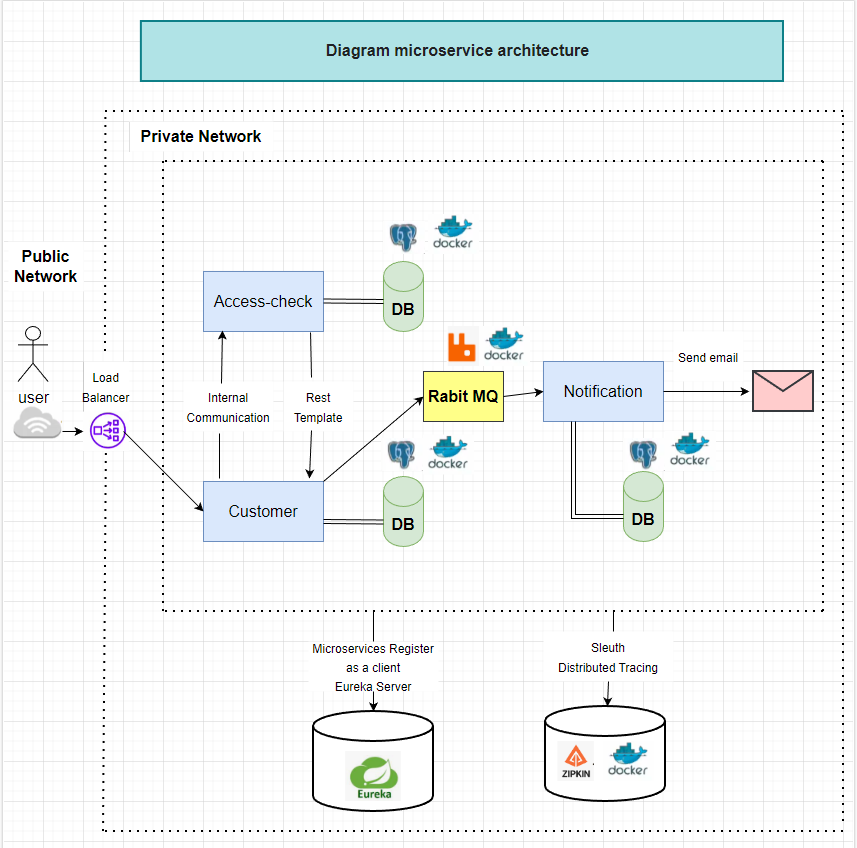

**Project**: microservice architecture for user registration.

The basic scheme of the project is presented in the diagram.

The project uses microservice architecture.

The project uses the following technologies:
1. **Eureka Server** - for registering microservices and viewing their status.

2. **OpenFeign** - for a declarative way to build HTTP clients with annotated interfaces and no code duplication.
3. **Spring Cloud Sleuth** - for distributed tracing, each request is assigned a unique id by which it can be tracked.
4. **Zipkin**  - is a distributed tracing system, it can accept and visualize request data.

5. **Spring Cloud API Gateway** - the technology through which all requests pass, an implementation of the Reverse Proxy pattern. That is, microservices do not know about each other, but turn to proxies. The external user also knows only the proxy. The proxy, in turn, analyzes the request, redirects it to the desired microservice and returns the response back.
6. **RestTemplate** is a synchronous client for making HTTP requests.
7. **RabbitMQ** is a distributed and scale-out message broker. Its main goal is to receive and send messages.

**_About the project_**: The customer registers by entering their name and email address.
The request passes through the Load Balancer and gets to the desired microservice.
The request enters the customer microservice and the user is saved to the database.
With the help of Open Feign customer microservice contacts the access microservice to validate the email address.
Access microservice using rest template by id finds the user and his email address.
If the email address entered by the user is banned, a "No access" error is thrown.
If the e-mail address is not banned, then the verification report is saved to the database.
A message is sent from the customer microservice via rabbitmq to welcome the user to the service.
Notification microservice reads messages from rabbitmq. As soon as a new message appears in the rabbitmq notification microservice reads it, saves it to its database and sends a welcome letter to the user in the service.